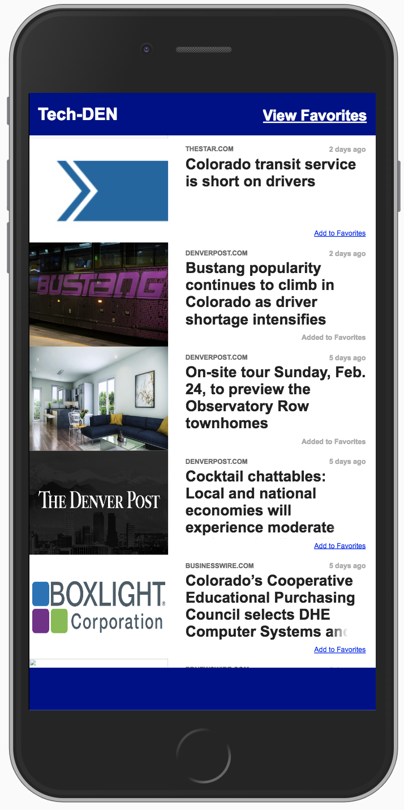
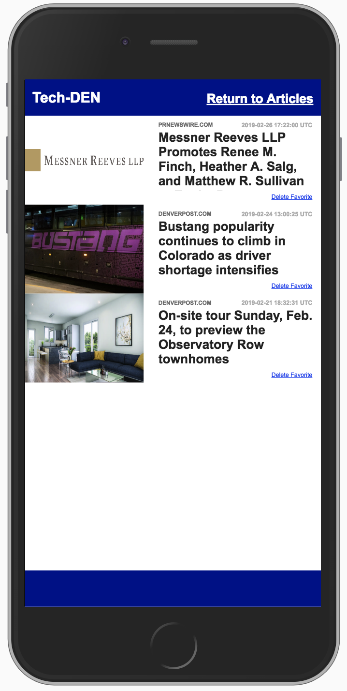
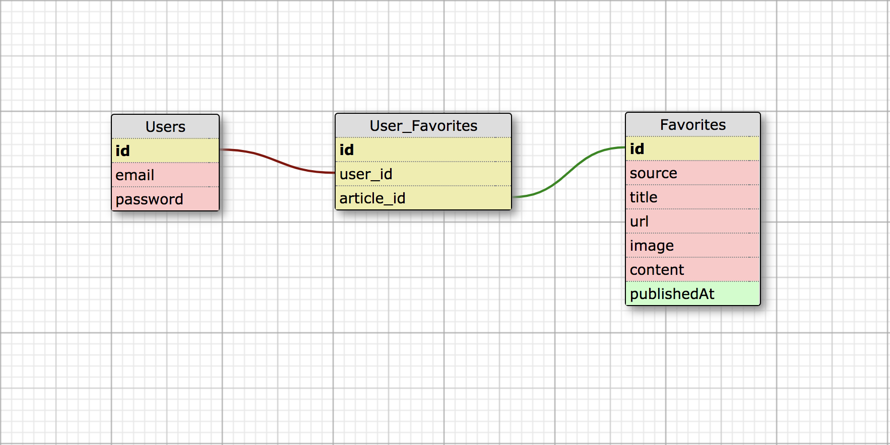

#### [Production Build](https://mngatewood-tech-den.herokuapp.com/)
#### [Project Board](https://github.com/mngatewood/tech-den/projects/1)

## Introduction

Tech-DEN is an application that displays recent published news articles related to technology in Denver.  It displays the 20 most recent articles fetched from NewsAPI and includes an image, headline, source, and age of each article.  Users can click any of the articles to be redirected to the source article.

Users are also able to save, view, and delete favorite articles using the simple interface.

## Initial Setup

These instructions will get a copy of the project up and running on your local machine for development and testing purposes.

From GitHub clone down repository using the following commands in terminal:

    git clone git@github.com:mngatewood.comk/tech-den.git
    cd tech-den

## How to Use

In the project directory run:

    bundle install

to install all the dependencies.

### Running the Server Locally

    rails s

Runs the app in the development mode, to view it in the browser click the link bellow:
[http://localhost:3000](http://localhost:3000).

### Running the Tests

    rspec

Launches the test suite, after the test suite run it will display the coverage.

## How to Use

When you first visit the application, the home page will be displayed with the 20 most recent news articles.

 <!-- .element style="width: 50%" -->

To save an article as a favorite, click the "Add to Favorites" link below the article's headline.  A message will be displayed in the footer indicating whether or not the save was successful.

To view saved favorites, click the link in the upper-right corner labelled "View Favorites".

 <!-- .element style="width: 50%" -->

To delete a favorite, click the "Delete Favorite" icon below the article's headline.  A message will display in the footer indicating whether or not the delete was successful.

To return to the home page, click the link in the upper right corner labelled "Return to Articles".

## Database Schema

## Future Enhancements

* User registration and log-in
* Validate URLs (source article and image)

## Sole Contributor

* Michael Gatewood - Github: [mngatewood](https://www.github.com/mngatewood)

## To Contribute

Fork and clone this repository. If you generate a pull request,  we can start a discussion about of the feature you build or you can contact us in the links above.   

## Built With

* [Ruby](https://ruby-lang.org/)
* [Rails](https://rubyonrails.org/)
* [RSpec](https://rspec.info/)
* [NewsAPI](https://newsapi.org)
* [Faraday](https://github.com/lostisland/faraday)
* [Travis CI](https://travis-ci.org/)
* [Heroku](https://herokuapp.com)
